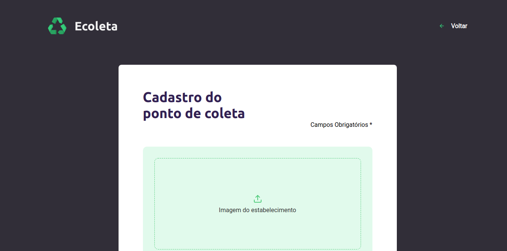
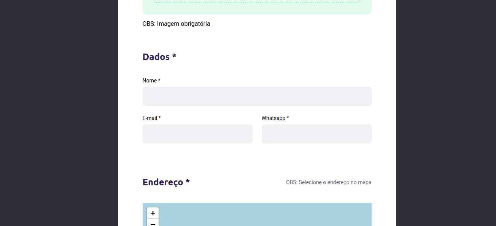
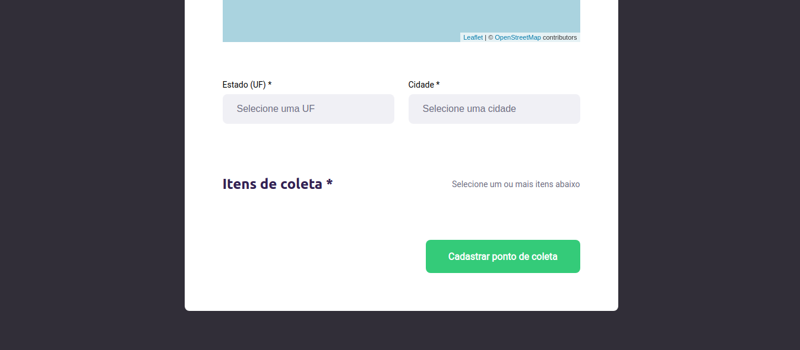

# __Ecoleta__

## __Commands__

> * ### yarn
> * ### yarn start

## __Projeto__
* URL: https://ecoleta-neylanio.netlify.app/

## __Images__
<figure>
    
</figure>  

<figure>
    
</figure>  

<figure>
    
</figure>  

<figure>
  
</figure>  

---

Done by Neylanio
